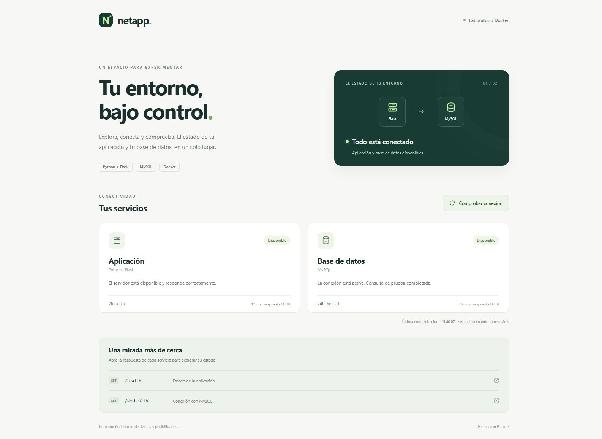
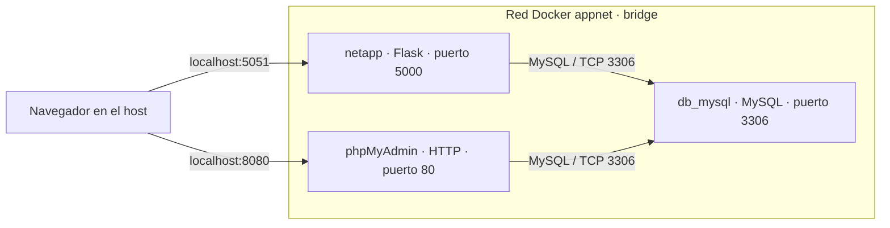

# Docker Networking Lab · Flask, MySQL y phpMyAdmin

Laboratorio práctico de redes Docker: una aplicación Flask se comunica con MySQL por nombre de contenedor, mientras phpMyAdmin permite administrar la misma base de datos desde el navegador. Los tres servicios comparten una red bridge personalizada llamada `appnet`.

El objetivo principal es practicar **Docker Networking**: DNS interno, comunicación entre contenedores, puertos internos y publicados, aislamiento de redes y diagnóstico de conectividad. La app sirve como punto de observación con una interfaz web y endpoints de salud.



## Qué se practica

- Crear una red bridge y conectar varios contenedores.
- Resolver nombres con el DNS de Docker, sin fijar direcciones IP.
- Distinguir conectividad ICMP, acceso TCP, respuestas HTTP y consultas SQL.
- Configurar una aplicación mediante variables de entorno: `-e` y `--env-file`.
- Construir una imagen Python básica y otra multietapa.
- Evaluar la disponibilidad de Flask y MySQL mediante `HEALTHCHECK`.
- Administrar MySQL con phpMyAdmin y con un cliente SQL dentro de la app.

## Arquitectura



| Contenedor | Función | Puerto interno | Acceso desde el host |
| --- | --- | --- | --- |
| `netapp` | App Flask y panel de conectividad | `5000` | `http://localhost:5051` |
| `db_mysql` | Base de datos MySQL | `3306` | No se publica; se accede desde `appnet` |
| `phpMyAdmin` | Administración web de MySQL | `80` | `http://localhost:8080` |

Los contenedores en una bridge personalizada pueden resolver nombres y alias entre sí. Dentro de `appnet`, la aplicación usa `db_mysql:3306`; publicar el puerto de MySQL en el host no es necesario para esta comunicación. [Referencia de redes bridge](https://docs.docker.com/engine/network/drivers/bridge/).

## Requisitos

- Docker Engine o Docker Desktop con contenedores Linux.
- Git para clonar el proyecto.
- Los comandos siguientes están escritos para **PowerShell**. El carácter de continuación es el acento grave: `` ` ``. En Bash se utiliza `\`.

## Ejecutar el laboratorio

Los pasos siguientes permiten reproducirlo desde cero. Si ya tienes `appnet` o contenedores con estos nombres, reutilízalos y omite su creación. La aplicación documentada se llama `netapp`; en la práctica también se usó `netapp-frontend`.

### 1. Clonar y preparar las variables

```powershell
git clone https://github.com/Andre1825/docker-networking-lab.git
cd docker-networking-lab
Copy-Item .env.example .env
Copy-Item .env.mysql.example .env.mysql
```

Edita ambos archivos y reemplaza las claves de ejemplo. `MYSQL_PASSWORD` debe coincidir con `DB_PASS`. También deben coincidir `MYSQL_USER` / `DB_USER` y `MYSQL_DATABASE` / `DB_NAME`.

### 2. Crear la red y levantar MySQL

```powershell
docker network create --driver bridge appnet
docker volume create mysql_lab_data

docker run -d --name db_mysql --network appnet `
  --env-file .env.mysql `
  -v mysql_lab_data:/var/lib/mysql `
  mysql:9
```

Espera a que MySQL termine de inicializarse antes de iniciar Flask. Puedes revisar sus mensajes con:

```powershell
docker logs --tail 30 db_mysql
```

El volumen conserva los datos al recrear el contenedor. Las variables `MYSQL_*` crean la base y el usuario **solo cuando el directorio de datos está vacío**. Cambiar el archivo después no modifica las credenciales de una base ya inicializada.

### 3. Construir la app

Imagen básica:

```powershell
docker build -f dockerfile -t netapp:basic .
```

Imagen multietapa, utilizada para las prácticas:

```powershell
docker build -f dockerfile-multistage -t netapp:v1 .
```

La etapa `builder` instala las dependencias en `/opt/venv`. La etapa final copia ese entorno y la aplicación, ejecuta con `appuser` e incorpora `HEALTHCHECK` y herramientas de diagnóstico. Estas herramientas forman parte del laboratorio y aumentan el tamaño de la imagen final.

### 4. Ejecutar Flask en la misma red

```powershell
docker run -d --name netapp --network appnet `
  -p 127.0.0.1:5051:5000 `
  --env-file .env `
  netapp:v1
```

Abre **http://localhost:5051**. El panel muestra los estados de Flask y MySQL, el tiempo de respuesta de sus comprobaciones y un botón de actualización.

`5051` es el puerto del host y `5000` es el del contenedor. También se practicó `-p 5000:5000`; aquí se usa `5051` para evitar conflictos con otra app en el host.

### 5. Levantar phpMyAdmin

```powershell
docker run -d --name phpMyAdmin --network appnet `
  -p 127.0.0.1:8080:80 `
  -e PMA_HOST=db_mysql `
  -e PMA_PORT=3306 `
  phpmyadmin/phpmyadmin
```

Abre **http://localhost:8080** e inicia sesión con el usuario y la contraseña configurados para MySQL. `PMA_HOST` indica el servidor al que se conectará phpMyAdmin y `PMA_PORT` su puerto interno. [Configuración Docker de phpMyAdmin](https://docs.phpmyadmin.net/en/latest/setup.html#docker-environment-variables).

Desde phpMyAdmin puedes explorar `networking_lab`, revisar tablas y ejecutar consultas. Para comprobar la sesión SQL sin cambiar datos:

```sql
SELECT DATABASE() AS base_actual, CURRENT_USER() AS usuario_actual;
SELECT 1 AS conexion_ok;
```

## Variables de entorno: `-e` y `.env`

| Variable de la app | Finalidad | Ejemplo |
| --- | --- | --- |
| `DB_HOST` | Nombre o IP del servidor MySQL | `db_mysql` |
| `DB_PORT` | Puerto de MySQL; opcional, por defecto `3306` | `3306` |
| `DB_NAME` | Base de datos existente | `networking_lab` |
| `DB_USER` | Usuario que tiene acceso a la base | `lab_user` |
| `DB_PASS` | Contraseña de ese usuario | Valor local, excluido de Git |

También se pueden proporcionar directamente al ejecutar el contenedor:

```powershell
docker run -d --name netapp --network appnet `
  -p 127.0.0.1:5051:5000 `
  -e DB_HOST=db_mysql `
  -e DB_PORT=3306 `
  -e DB_NAME=networking_lab `
  -e DB_USER=lab_user `
  -e DB_PASS=CAMBIA_ESTA_CLAVE `
  netapp:v1
```

Es una alternativa al paso 4, no un segundo contenedor con el mismo nombre. En este laboratorio se eligió **`--env-file .env`** para reunir la configuración local y evitar repetir las variables en cada comando. [Variables en `docker run`](https://docs.docker.com/reference/cli/docker/container/run/#set-environment-variables--e---env---env-file).

Docker lee el archivo e inyecta sus valores en el entorno del contenedor. La app usa `os.environ`; no carga automáticamente el `.env` al ejecutar `python app.py` fuera de Docker.

Si faltan variables obligatorias, la app las solicita por consola; `DB_PASS` se solicita ocultando la entrada. Para esa modalidad se necesita `docker run -it`. Si falta configuración en una ejecución sin entrada interactiva, o la conexión inicial a MySQL falla, la app muestra el error y termina.

Los `.env` reales están excluidos mediante `.gitignore` y `.dockerignore`. Se publican únicamente `.env.example` y `.env.mysql.example`. Un `.env` permite organizar la configuración, pero no cifra las contraseñas: en un despliegue real deben gestionarse con los mecanismos de secretos del entorno.

## Prácticas de Docker Networking

### Inspeccionar la red desde PowerShell

```powershell
docker network ls
docker network inspect appnet
docker ps --format "table {{.Names}}\t{{.Networks}}\t{{.Ports}}"
```

En `docker network inspect appnet`, verifica que aparezcan `netapp`, `db_mysql` y `phpMyAdmin`. Las IP son asignadas por Docker; las conexiones se configuran por nombre.

### Diagnosticar desde el contenedor de la app

```powershell
docker exec -it netapp bash
```

Dentro del contenedor, los siguientes comandos usan sintaxis **Bash**:

```bash
# DNS: resolver el nombre de MySQL
nslookup "$DB_HOST"
dig +short "$DB_HOST" A

# ICMP: comprobar si el contenedor responde
ping -c 3 "$DB_HOST"

# TCP: comprobar si el puerto MySQL acepta conexiones
nc -vz -w 3 "$DB_HOST" "${DB_PORT:-3306}"

# Interfaces, rutas y puertos de escucha
ip addr
ip route
ss -lnt
netstat -lnt

# HTTP: comprobar la app y su conexión a MySQL
curl -fsS http://localhost:5000/health
curl -fsS http://localhost:5000/db-health

# SQL: abrir una sesión y solicitar la contraseña
mysql --skip-ssl-verify-server-cert \
  -h "$DB_HOST" -P "${DB_PORT:-3306}" \
  -u "$DB_USER" -p "$DB_NAME"
```

El paquete Debian `default-mysql-client` proporciona un cliente MariaDB compatible con MySQL. En la práctica, MySQL tenía un certificado autofirmado; el ejemplo omite verificar ese certificado **solo para el laboratorio**. Para una conexión con validación de identidad, configura la CA correspondiente y omite esa opción. [Cliente y TLS](https://mariadb.com/docs/server/security/encryption/data-in-transit-encryption/securing-connections-for-client-and-server).

En la sesión SQL:

```sql
SELECT 1 AS conexion_ok;
SHOW TABLES;
exit;
```

`ping` comprueba ICMP, `nc` comprueba un puerto TCP y el cliente SQL comprueba autenticación y consultas. Una respuesta a ping no garantiza que MySQL esté listo. `curl` comprueba HTTP; hacer `curl` al puerto `3306` no valida una conexión MySQL.

### Comunicación en sentido contrario

La comunicación también puede darse desde la BD hacia la app. Si el contenedor de la BD tiene `curl` instalado:

```powershell
docker exec db_mysql curl http://netapp:5000/health
```

La imagen de MySQL puede no incluir esa herramienta. Para observar la red de la BD sin instalar paquetes en ella, utiliza un contenedor temporal que comparta su espacio de red:

```powershell
docker run --rm --network container:db_mysql `
  --entrypoint curl netapp:v1 `
  -fsS http://netapp:5000/health
```

Dentro de un contenedor, `localhost` identifica ese mismo contenedor. Para alcanzar la app desde otro servicio se usa `netapp:5000`, no `localhost:5051`.

### Reproducir el error de DNS observado

Este comando omite `--network appnet`:

```powershell
docker run --rm --env-file .env netapp:v1
```

Como `DB_HOST=db_mysql` no se resuelve desde la bridge predeterminada, la app puede mostrar:

```text
Unknown MySQL server host 'db_mysql'
```

La solución es conectar la app a `appnet` con `--network appnet`. No es necesario cambiar `DB_HOST` por una IP ni publicar `3306` en el host.

## Healthcheck

| Endpoint | Qué comprueba | Respuesta |
| --- | --- | --- |
| `/` | Interfaz del laboratorio | HTML |
| `/health` | Disponibilidad de Flask | HTTP `200`, `status: ok` |
| `/db-health` | Conexión MySQL y `SELECT 1` | HTTP `200` si funciona; `503` si falla |

El Dockerfile multietapa consulta `/db-health` cada **30 s**, con timeout de **10 s**, periodo inicial de **20 s** y **3 fallos consecutivos** antes de marcar `unhealthy`.

```powershell
docker inspect --format '{{.State.Health.Status}}' netapp
docker inspect --format '{{json .State.Health}}' netapp
docker ps
```

Los estados son `starting`, `healthy` y `unhealthy`. Este healthcheck informa del estado; por sí solo no reinicia el contenedor. [Referencia de HEALTHCHECK](https://docs.docker.com/reference/dockerfile/#healthcheck).

Para practicar un fallo, desconecta **solo la app** y después reconéctala:

```powershell
docker network disconnect appnet netapp
# Espera varias comprobaciones y consulta el estado.
docker inspect --format '{{.State.Health.Status}}' netapp
docker network connect appnet netapp
# Vuelve a consultar cuando la conexion se haya recuperado.
docker inspect --format '{{.State.Health.Status}}' netapp
```

Durante la desconexión, el acceso desde el host también puede quedar interrumpido. Si la conexión inicial falla, el proceso termina y debes corregirla antes de volver a iniciar el contenedor.

## Evidencias de la práctica

Se verificaron en el entorno del laboratorio:

- Resolución de `db_mysql`, ping y acceso TCP al puerto `3306` desde la app.
- Una consulta `SELECT 1` con el conector Python y con el cliente MySQL.
- Respuestas correctas de Flask y `/db-health`.
- Transición `healthy → unhealthy → healthy` al desconectar y reconectar un contenedor temporal de prueba.
- Interfaz en escritorio y móvil, botón de actualización y respuesta HTTP `503` ante un fallo simulado de MySQL.
- phpMyAdmin en ejecución, conectado a `appnet` y publicado en el puerto `8080`. La administración de la BD se realiza al iniciar sesión desde su interfaz.

Estas pruebas comprueban los componentes indicados. Compartir una red habilita la comunicación; las credenciales, el puerto y la disponibilidad de MySQL también deben ser correctos.

## Archivos del proyecto

```text
app.py                   App Flask, configuracion MySQL y endpoints
requirements.txt         Flask y mysql-connector-python
dockerfile               Imagen Python basica
dockerfile-multistage     Imagen con herramientas de red y healthcheck
templates/index.html     Interfaz web
static/                  Estilos y comprobaciones desde el navegador
.env.example             Ejemplo de variables de la app
.env.mysql.example       Ejemplo de inicializacion de MySQL
.gitignore               Exclusion de credenciales y archivos locales
.dockerignore            Exclusion de archivos del contexto de build
docs/frontend.png        Captura de la interfaz
```

## Detener el laboratorio

```powershell
docker stop netapp phpMyAdmin db_mysql
```

Los datos siguen en `mysql_lab_data`. Si creaste los contenedores sin `--rm`, puedes iniciarlos de nuevo con `docker start db_mysql`, esperar a MySQL y ejecutar `docker start netapp phpMyAdmin`.

## Descripción breve para el CV

> Laboratorio de Docker Networking con Flask, MySQL y phpMyAdmin: red bridge personalizada, DNS entre contenedores, diagnóstico ICMP/TCP/HTTP, configuración por variables de entorno, imágenes multietapa y healthchecks.
