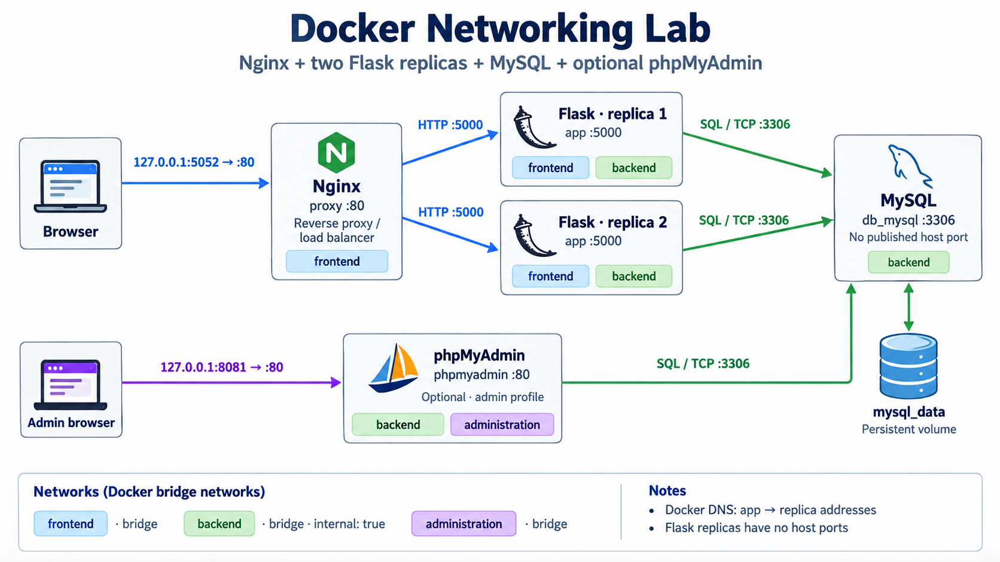

# Docker Networking Lab · Nginx, Flask, MySQL and phpMyAdmin

A practical Docker networking lab. The Compose stack uses Nginx to balance HTTP requests across two Flask replicas, with MySQL on an internal backend network and optional phpMyAdmin on separate backend and administration networks. The earlier manual `docker run` lab, documented below, uses one shared bridge named `appnet`.

The main goal is to practice **Docker Networking**: internal DNS, communication between containers, internal and published ports, network isolation and connectivity troubleshooting. The app provides a web dashboard and health endpoints for observing the lab.

## Docker Compose with a reverse proxy and replicas

The project includes `compose.yml`, a read-only [Nginx configuration](nginx/nginx.conf), and a [detailed English guide ready for Notion](docs/docker-compose-guide.md). Compose creates its own networks and database volume, independently of the manual containers documented below. `deploy` defines two app replicas and resource limits; only the proxy publishes the application port.

```powershell
if (-not (Test-Path .env.compose)) {
    Copy-Item .env.compose.example .env.compose
}
# For a new setup only; keep an existing .env.compose and its database credentials.
# Edit .env.compose: replace both passwords and use a non-root DB_USER.
docker compose --env-file .env.compose config --quiet
docker compose --env-file .env.compose --profile admin up -d --build --wait --wait-timeout 240
```

The dashboard is available through Nginx at `http://localhost:5052`, and optional phpMyAdmin at `http://localhost:8081`. MySQL and the Flask replicas do not publish host ports. Omit `--profile admin` to start the proxy, app and database without phpMyAdmin.

```powershell
# Check which Flask replica handled each request.
1..10 | ForEach-Object {
    curl.exe -sS -D - -o NUL http://localhost:5052/health |
        Select-String 'X-Lab-Upstream'
}

# Change the replica count for this run without publishing extra host ports.
docker compose --env-file .env.compose up -d --scale app=3 --wait --wait-timeout 240
```

The proxy refreshes service DNS automatically. A later `up` without `--scale` returns to the two replicas declared in `compose.yml`. The guide explains network isolation, passive failover, scaling, deployment limitations and verification commands. Brief gateway errors can occur during replica removal while DNS and in-flight connections converge.


## What this lab covers

- Creating bridge networks and connecting multiple containers.
- Resolving service names through Docker DNS without fixed IP addresses.
- Distinguishing ICMP connectivity, TCP access, HTTP responses and SQL queries.
- Configuring an application with environment variables: `-e` and `--env-file`.
- Building a basic Python image and a multistage image.
- Checking Flask and MySQL readiness with `HEALTHCHECK`.
- Managing MySQL through phpMyAdmin and a SQL client inside the app container.
- Balancing requests across Flask replicas with Nginx and dynamic service discovery.
- Separating frontend, backend and administration traffic, with per-container resource limits.

## Final Compose architecture



The diagram was created with GPT Images from the actual Compose configuration. Its [generation prompt](docs/architecture-prompt.md) is included for reference.

| Service | Role | Internal port | Networks | Host access |
| --- | --- | --- | --- | --- |
| `proxy` | Nginx reverse proxy and load balancer | `80` | `frontend` | `http://localhost:5052` |
| `app` · two replicas | Flask dashboard and health endpoints | `5000` per replica | `frontend`, `backend` | Through Nginx |
| `db_mysql` | MySQL database | `3306` | `backend` | No published host port |
| `phpmyadmin` · optional | Web-based MySQL administration | `80` | `backend`, `administration` | `http://localhost:8081` |

All three networks use the bridge driver. `backend` has `internal: true`. Nginx shares only the frontend network with the app replicas, so it does not have direct network access to MySQL or phpMyAdmin. Each app also joins backend to reach `db_mysql:3306`. phpMyAdmin joins administration so its localhost port can be published while MySQL remains on backend only.

Both published ports bind to `127.0.0.1`. The database persists in the project-scoped `mysql_data` volume. Docker DNS discovers replica addresses; container IPs are not hard-coded. The default project name is `docker-networking-lab`, so the networks are named `docker-networking-lab_frontend`, `docker-networking-lab_backend` and `docker-networking-lab_administration`.

The manual workflow below has a different topology: one app, MySQL and phpMyAdmin all share `appnet`, with host ports `5051` and `8080`. Its `mysql_lab_data` volume is separate from the Compose database. Containers on a custom bridge can resolve each other's names and aliases without publishing MySQL's port. [Bridge networking reference](https://docs.docker.com/engine/network/drivers/bridge/).

## Prerequisites

- Docker Engine or Docker Desktop running Linux containers.
- Docker Compose v2 for the Compose workflow.
- Git to clone the project.
- The following host commands use **PowerShell**. Its continuation character is the backtick: `` ` ``. Bash uses `\`.

## Run the manual lab

The following steps reproduce the original manual workflow from scratch. If `appnet` or containers with these names already exist, reuse them and skip their creation. The application container documented here is named `netapp`; `netapp-frontend` was also used during the exercises.

### 1. Clone the project and prepare environment variables

```powershell
git clone https://github.com/Andre1825/docker-networking-lab.git
cd docker-networking-lab
Copy-Item .env.example .env
Copy-Item .env.mysql.example .env.mysql
```

Edit both files and replace the example passwords. `MYSQL_PASSWORD` must match `DB_PASS`. The pairs `MYSQL_USER` / `DB_USER` and `MYSQL_DATABASE` / `DB_NAME` must also match.

### 2. Create the network and start MySQL

```powershell
docker network create --driver bridge appnet
docker volume create mysql_lab_data

docker run -d --name db_mysql --network appnet `
  --env-file .env.mysql `
  -v mysql_lab_data:/var/lib/mysql `
  mysql:9
```

Wait for MySQL to finish initializing before starting Flask. Check its logs with:

```powershell
docker logs --tail 30 db_mysql
```

The volume preserves data when the container is recreated. The `MYSQL_*` variables create the database and user **only when the data directory is empty**. Editing the file later does not change credentials in an initialized database.

### 3. Build the app

Basic image:

```powershell
docker build -f dockerfile -t netapp:basic .
```

Multistage image used for the exercises:

```powershell
docker build -f dockerfile-multistage -t netapp:v1 .
```

The `builder` stage installs dependencies in `/opt/venv`. The final stage copies that environment and the app, runs as `appuser`, and includes a `HEALTHCHECK` and troubleshooting tools. These tools support the lab and increase the final image size.

### 4. Run Flask on the same network

```powershell
docker run -d --name netapp --network appnet `
  -p 127.0.0.1:5051:5000 `
  --env-file .env `
  netapp:v1
```

Open **http://localhost:5051**. The dashboard shows Flask and MySQL status, healthcheck response times and a refresh button.

`5051` is the host port and `5000` is the container port. The lab also used `-p 5000:5000`; this guide uses `5051` to avoid conflicts with another app on the host.

### 5. Start phpMyAdmin

```powershell
docker run -d --name phpMyAdmin --network appnet `
  -p 127.0.0.1:8080:80 `
  -e PMA_HOST=db_mysql `
  -e PMA_PORT=3306 `
  phpmyadmin/phpmyadmin
```

Open **http://localhost:8080** and log in with the configured MySQL username and password. `PMA_HOST` identifies the database server and `PMA_PORT` its internal port. [phpMyAdmin Docker configuration](https://docs.phpmyadmin.net/en/latest/setup.html#docker-environment-variables).

Use phpMyAdmin to explore `networking_lab`, inspect tables and execute queries. To check the SQL session without changing data:

```sql
SELECT DATABASE() AS current_database, CURRENT_USER() AS current_user_account;
SELECT 1 AS connection_ok;
```

## Environment variables: `-e` and `.env`

| App variable | Purpose | Example |
| --- | --- | --- |
| `DB_HOST` | MySQL server name or IP address | `db_mysql` |
| `DB_PORT` | MySQL port; optional, defaults to `3306` | `3306` |
| `DB_NAME` | Existing database | `networking_lab` |
| `DB_USER` | User with access to the database | `lab_user` |
| `DB_PASS` | That user's password | Local value, excluded from Git |

You can also supply them directly when starting the container:

```powershell
docker run -d --name netapp --network appnet `
  -p 127.0.0.1:5051:5000 `
  -e DB_HOST=db_mysql `
  -e DB_PORT=3306 `
  -e DB_NAME=networking_lab `
  -e DB_USER=lab_user `
  -e DB_PASS=CHANGE_THIS_PASSWORD `
  netapp:v1
```

This is an alternative to step 4, rather than a second container with the same name. The lab uses **`--env-file .env`** to keep local configuration together and avoid repeating variables in each command. [Environment variables in `docker run`](https://docs.docker.com/reference/cli/docker/container/run/#set-environment-variables--e---env---env-file).

Docker reads the file and injects its values into the container environment. The app uses `os.environ`; it does not automatically load `.env` when you run `python app.py` outside Docker.

If required variables are missing, the app prompts for them in the console; input for `DB_PASS` is hidden. This mode requires `docker run -it`. If configuration is missing without interactive input, or the initial MySQL connection fails, the app prints an error and exits.

Real `.env` files are excluded through `.gitignore` and `.dockerignore`. Only templates such as `.env.example`, `.env.mysql.example` and `.env.compose.example` are intended for publication. An `.env` file organizes configuration but does not encrypt passwords. A real deployment should use the environment's secret-management mechanisms.

## Docker Networking exercises

### Inspect the manual network from PowerShell

```powershell
docker network ls
docker network inspect appnet
docker ps --format "table {{.Names}}\t{{.Networks}}\t{{.Ports}}"
```

In `docker network inspect appnet`, check that `netapp`, `db_mysql` and `phpMyAdmin` appear. Docker assigns their IP addresses; connections use service or container names.

### Troubleshoot from the app container

```powershell
docker exec -it netapp bash
```

Inside the container, the following commands use **Bash** syntax:

```bash
# DNS: resolve the MySQL service name.
nslookup "$DB_HOST"
dig +short "$DB_HOST" A

# ICMP: check whether the container responds.
ping -c 3 "$DB_HOST"

# TCP: check whether the MySQL port accepts connections.
nc -vz -w 3 "$DB_HOST" "${DB_PORT:-3306}"

# Inspect interfaces, routes and listening ports.
ip addr
ip route
ss -lnt
netstat -lnt

# HTTP: check the app and its MySQL connection.
curl -fsS http://localhost:5000/health
curl -fsS http://localhost:5000/db-health

# SQL: open a session and prompt for the password.
mysql --skip-ssl-verify-server-cert \
  -h "$DB_HOST" -P "${DB_PORT:-3306}" \
  -u "$DB_USER" -p "$DB_NAME"
```

The Debian package `default-mysql-client` provides a MariaDB client compatible with MySQL. The lab's MySQL server used a self-signed certificate; the example skips certificate verification **for this lab only**. For a connection that validates server identity, configure the appropriate CA and omit that option. [Client TLS configuration](https://mariadb.com/docs/server/security/encryption/data-in-transit-encryption/securing-connections-for-client-and-server).

Inside the SQL session:

```sql
SELECT 1 AS connection_ok;
SHOW TABLES;
exit;
```

`ping` checks ICMP, `nc` checks a TCP port, and the SQL client checks authentication and queries. A ping response does not guarantee that MySQL is ready. `curl` checks HTTP; using `curl` against port `3306` does not validate a MySQL connection.

### Test communication in the opposite direction

The database container can also communicate with the app. If the database container has `curl` installed:

```powershell
docker exec db_mysql curl http://netapp:5000/health
```

The MySQL image may not include that tool. To inspect the database's network without installing packages in its container, run a temporary container sharing its network namespace:

```powershell
docker run --rm --network container:db_mysql `
  --entrypoint curl netapp:v1 `
  -fsS http://netapp:5000/health
```

Inside a container, `localhost` refers to that container itself. To reach the app from another service, use `netapp:5000`, rather than `localhost:5051`.

### Reproduce the observed DNS error

This command omits `--network appnet`:

```powershell
docker run --rm --env-file .env netapp:v1
```

Because `DB_HOST=db_mysql` cannot be resolved from the default bridge, the app may report:

```text
Unknown MySQL server host 'db_mysql'
```

Connect the app to `appnet` with `--network appnet` to fix it. You do not need to replace `DB_HOST` with an IP address or publish port `3306` on the host.

## Healthcheck

| Endpoint | What it checks | Response |
| --- | --- | --- |
| `/` | Lab interface | HTML |
| `/health` | Flask availability | HTTP `200`, `status: ok` |
| `/db-health` | MySQL connection and `SELECT 1` | HTTP `200` on success; `503` on failure |
| `/nginx-health` · Compose only | Nginx liveness | HTTP `204` |

The multistage Dockerfile requests `/db-health` every **30 seconds**, with a **10-second** timeout, a **20-second** start period and **3 consecutive failures** before marking the container `unhealthy`.

```powershell
docker inspect --format '{{.State.Health.Status}}' netapp
docker inspect --format '{{json .State.Health}}' netapp
docker ps
```

The states are `starting`, `healthy` and `unhealthy`. This healthcheck reports status; it does not restart the container by itself. [HEALTHCHECK reference](https://docs.docker.com/reference/dockerfile/#healthcheck).

To simulate a failure in the manual lab, disconnect **only the app** and then reconnect it:

```powershell
docker network disconnect appnet netapp
# Wait for several checks and inspect the status.
docker inspect --format '{{.State.Health.Status}}' netapp
docker network connect appnet netapp
# Check again after the connection has recovered.
docker inspect --format '{{.State.Health.Status}}' netapp
```

Host access may also be interrupted while the container is disconnected. If the initial connection fails, the process exits; fix the connection before starting the container again.

## Verification evidence

The following checks were performed in the original manual lab:

- Resolving `db_mysql`, pinging it and reaching TCP port `3306` from the app.
- Running `SELECT 1` through the Python connector and the MySQL client.
- Receiving successful responses from Flask and `/db-health`.
- Observing `healthy → unhealthy → healthy` when disconnecting and reconnecting a temporary test container.
- Checking the desktop and mobile interface, refresh button and HTTP `503` response during a simulated MySQL failure.
- Running phpMyAdmin on `appnet`, published on port `8080`. Database administration is available after logging into its web interface.

The final Compose stack was also tested for Nginx routing, load balancing across both replicas, resource limits, network membership, SQL connectivity and scaling **2 → 3 → 2** without restarting Nginx. The [detailed guide](docs/docker-compose-guide.md) records the results and the brief DNS convergence window during replica removal.

These checks cover the components listed above. Sharing a network enables communication; credentials, ports and MySQL readiness must also be correct.

## Project files

```text
app.py                       Flask app, MySQL configuration and endpoints
requirements.txt             Flask and mysql-connector-python
dockerfile                   Basic Python image
dockerfile-multistage         Image with networking tools and a healthcheck
compose.yml                  Services, replicas, networks and deployment limits
nginx/nginx.conf              Reverse proxy and dynamic upstream configuration
templates/index.html         Web interface
static/                      Styles and browser-side health checks
.env.example                 App environment template for the manual lab
.env.mysql.example           MySQL initialization template for the manual lab
.env.compose.example         Environment template for the Compose stack
.gitignore                   Excludes credentials and local files
.dockerignore                Excludes files from the build context
docs/frontend.png            Dashboard screenshot
docs/architecture.png        Final Compose architecture generated with GPT Images
docs/architecture-prompt.md   Diagram generation prompt
docs/docker-compose-guide.md  Detailed English guide and verification results
```

## Stop the lab

For the manual workflow:

```powershell
docker stop netapp phpMyAdmin db_mysql
```

Data remains in `mysql_lab_data`. If the containers were created without `--rm`, start them again with `docker start db_mysql`, wait for MySQL, and then run `docker start netapp phpMyAdmin`.

For the Compose workflow:

```powershell
docker compose --env-file .env.compose --profile admin down
```

The Compose database volume is retained. Adding `--volumes` deliberately deletes that project's persistent database data; omit it during a routine shutdown.

## Short portfolio description

> Docker Networking lab with an Nginx reverse proxy, two Flask replicas, MySQL and optional phpMyAdmin: custom bridge networks, dynamic service DNS, load balancing, ICMP/TCP/HTTP diagnostics, environment-based configuration, multistage images, resource limits and healthchecks.
